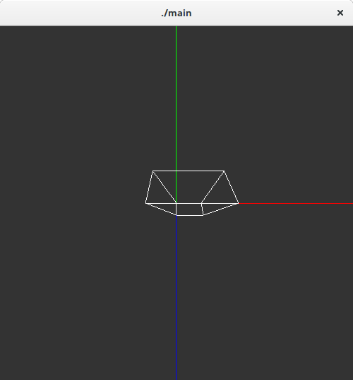
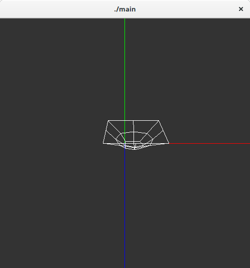

# Catmull Clark Subdivisional Algorithm

This project provides routines to convert a given polygonal mesh to a subdivisional mesh.

### Output

Polygon: 

After Subdivision:

### Limitations

* The max number of vertices, faces has to be harcoded. 
* The edge points are duplicated.
* The faces are defined using vertex indices in the counter clockwise direction.

### Compilation

To install OpenGL 2.0 on Ubuntu 16.04
    
    sudo apt-get install freeglut3 freeglut3-dev libglew1.5 libglew1.5-dev libglu1-mesa libglu1-mesa-dev libgl1-mesa-glx libgl1-mesa-dev

Expects OpenGL 2.0 libraries to be installed.
*usleep()* may have to be replaced by *sleep()* in windows.

Compile with gcc using the usual arguments:
   
    gcc "main.c" -lglut -lGLU -lGL -o "main"

Execute:

    ./main

### Object File Format

* LINE SIZE should be less than 128
* All Indices start from 0
* Vertex format: v x,y,z 
* quad format: f v1,v2,v3,v4 

